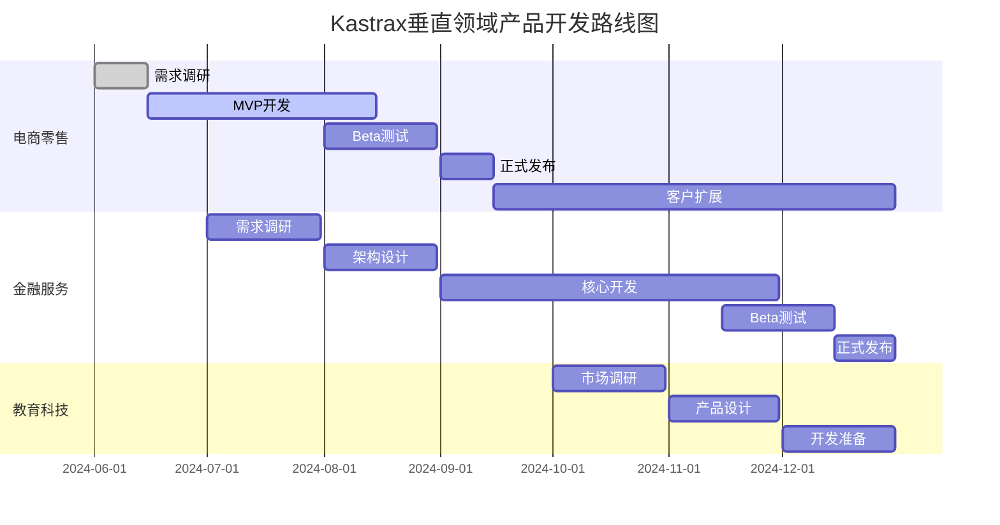

# 🗺️ Kastrax垂直领域战略路线图

## 📅 2024年6-12月执行时间线



## 🎯 垂直领域优先级矩阵

| 领域 | 市场规模 | 技术适配性 | 开发复杂度 | ROI | 优先级 |
|------|----------|------------|------------|-----|--------|
| 🛒 电商零售 | ⭐⭐⭐⭐ | ⭐⭐⭐⭐⭐ | ⭐⭐ | ⭐⭐⭐⭐⭐ | 🥇 |
| 🏦 金融服务 | ⭐⭐⭐⭐⭐ | ⭐⭐⭐⭐⭐ | ⭐⭐⭐ | ⭐⭐⭐⭐⭐ | 🥈 |
| 📚 教育科技 | ⭐⭐⭐ | ⭐⭐⭐⭐⭐ | ⭐⭐⭐ | ⭐⭐⭐ | 🥉 |
| 🏭 制造业 | ⭐⭐⭐⭐ | ⭐⭐⭐⭐ | ⭐⭐⭐⭐ | ⭐⭐⭐ | 4️⃣ |
| 🏥 医疗健康 | ⭐⭐⭐⭐⭐ | ⭐⭐⭐⭐ | ⭐⭐⭐⭐⭐ | ⭐⭐⭐ | 5️⃣ |

## 💰 收入预测与投资回报

### 收入增长曲线
```
$25M |                                    ●
     |                               ●
$20M |                          ●
     |                     ●
$15M |                ●
     |           ●
$10M |      ●
     | ●
$5M  |●
     |
$0   +--+--+--+--+--+--+--+--+--+--+--+--+
     Q2 Q3 Q4 Q1 Q2 Q3 Q4 Q1 Q2 Q3 Q4
     2024    2025         2026
```

### 各领域收入贡献
```
2024年 ($0.58M)          2025年 ($6.8M)           2026年 ($20.5M)
┌─────────────────┐      ┌─────────────────┐      ┌─────────────────┐
│ 电商零售: 60%   │      │ 电商零售: 35%   │      │ 电商零售: 29%   │
│ 金融服务: 40%   │      │ 金融服务: 53%   │      │ 金融服务: 44%   │
│                 │      │ 教育科技: 12%   │      │ 教育科技: 12%   │
│                 │      │                 │      │ 制造业: 15%     │
└─────────────────┘      └─────────────────┘      └─────────────────┘
```

## 🏗️ 技术架构演进

### 阶段1: 基础平台 (2024 Q2-Q3)
```
┌─────────────────────────────────────────┐
│              Kastrax Core               │
├─────────────────────────────────────────┤
│ Actor System │ RAG Engine │ Memory API │
├─────────────────────────────────────────┤
│        电商零售解决方案模块              │
└─────────────────────────────────────────┘
```

### 阶段2: 垂直扩展 (2024 Q3-Q4)
```
┌─────────────────────────────────────────┐
│              Kastrax Core               │
├─────────────────────────────────────────┤
│ Actor System │ RAG Engine │ Memory API │
├─────────────────────────────────────────┤
│ 电商零售模块 │ 金融服务模块 │ 共享组件  │
└─────────────────────────────────────────┘
```

### 阶段3: 平台化 (2025+)
```
┌─────────────────────────────────────────┐
│           Kastrax Platform              │
├─────────────────────────────────────────┤
│ 电商 │ 金融 │ 教育 │ 制造 │ 医疗 │ ... │
├─────────────────────────────────────────┤
│              Kastrax Core               │
└─────────────────────────────────────────┘
```

## 👥 团队建设计划

### 组织架构演进
```
2024年6月 (15人)        2024年12月 (50人)       2025年12月 (100人)
     CEO                      CEO                      CEO
      │                        │                        │
  ┌───┼───┐               ┌────┼────┐              ┌────┼────┐
 CTO  CPO CMO            CTO   CPO   CMO           CTO   CPO   CMO
  │    │   │              │     │     │            │     │     │
 工程  产品 市场         工程   产品   市场        工程   产品   市场
(8人) (3人)(2人)       (25人) (12人) (8人)      (50人) (25人)(15人)
                          │                        │
                      垂直事业部                垂直事业部
                     (电商+金融)              (5个垂直领域)
```

### 关键岗位招聘时间表
```
2024年6月: 电商产品经理、金融技术专家
2024年7月: 垂直领域销售经理 × 2
2024年8月: 客户成功经理 × 2
2024年9月: 合规专家、安全工程师
2024年10月: 国际化团队 × 3
2024年11月: 数据科学家 × 2
2024年12月: 战略合作经理 × 2
```

## 🤝 合作伙伴生态地图

### 技术合作伙伴
```
云服务商          AI服务商          数据库厂商
┌─────────┐      ┌─────────┐      ┌─────────┐
│ 阿里云  │      │ DeepSeek│      │ MongoDB │
│ 腾讯云  │ ←→   │ 智谱AI  │ ←→   │ Redis   │
│ 华为云  │      │ 百川智能│      │PostgreSQL│
└─────────┘      └─────────┘      └─────────┘
```

### 业务合作伙伴
```
电商服务商        金融科技          系统集成商
┌─────────┐      ┌─────────┐      ┌─────────┐
│ 有赞    │      │ 恒生电子│      │ 软通动力│
│ 微盟    │ ←→   │ 金证股份│ ←→   │ 东软集团│
│ 点点客  │      │ 顶点软件│      │ 中软国际│
└─────────┘      └─────────┘      └─────────┘
```

## 📊 关键成功指标仪表板

### 业务指标
```
客户数量                收入增长               客户满意度
   50                    $2.5M                   NPS: 50+
  ┌──┐                 ┌─────┐                 ┌─────────┐
  │██│ 2024目标        │ ███ │ ARR目标         │ ████████│
  └──┘                 └─────┘                 └─────────┘
```

### 技术指标
```
系统可用性            响应时间               错误率
  99.5%                <200ms                <0.5%
 ┌──────┐             ┌──────┐              ┌──────┐
 │██████│             │██████│              │██████│
 └──────┘             └──────┘              └──────┘
```

### 市场指标
```
市场份额              品牌知名度             合作伙伴
  0.1%                 行业前10               20+
 ┌──────┐             ┌──────┐              ┌──────┐
 │██████│             │██████│              │██████│
 └──────┘             └──────┘              └──────┘
```

## 🚨 风险预警系统

### 风险等级分类
```
🔴 高风险 (立即处理)
├── 技术债务积累
├── 关键人才流失
└── 重大安全事件

🟡 中风险 (密切关注)
├── 竞争对手跟进
├── 客户采用缓慢
└── 监管政策变化

🟢 低风险 (定期评估)
├── 市场需求波动
├── 技术标准变化
└── 供应商依赖
```

### 风险监控频率
```
日常监控: 系统性能、安全事件
周度监控: 项目进度、团队状态
月度监控: 财务状况、客户满意度
季度监控: 市场变化、竞争态势
年度监控: 战略调整、长期规划
```

## 🎯 2024年关键里程碑

### Q2 2024 (基础建设)
- [ ] 垂直领域团队组建完成
- [ ] 电商解决方案MVP开发
- [ ] 首个试点客户签约
- [ ] 技术基础设施搭建

### Q3 2024 (产品发布)
- [ ] 电商解决方案正式发布
- [ ] 获得10个付费客户
- [ ] 金融解决方案开发启动
- [ ] 合作伙伴生态初步建立

### Q4 2024 (规模扩张)
- [ ] 金融解决方案Beta发布
- [ ] 客户数量达到50个
- [ ] ARR达到$2.5M
- [ ] 新一轮融资完成

## 📈 长期愿景 (2025-2027)

### 2025年: 垂直领域领导者
- 5个垂直领域全面覆盖
- 年收入突破$20M
- 成为行业标杆企业

### 2026年: 平台化转型
- 低代码/无代码平台上线
- 开发者生态系统建立
- 国际市场拓展

### 2027年: 生态系统领导者
- AI Agent应用商店
- 全球化部署
- 行业标准制定者

---

**📞 联系信息**
- 项目负责人: [项目经理姓名]
- 邮箱: strategy@kastrax.ai
- 更新频率: 每月更新
- 最后更新: 2024年6月7日
